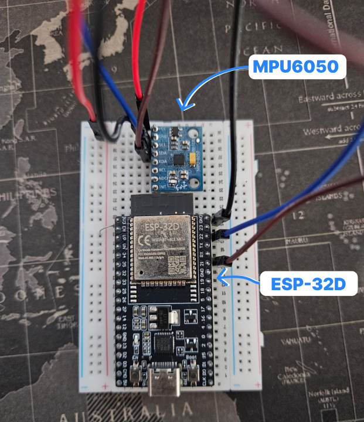

# Monitoramento de Vibração para Motores de Irrigação



O **Hydrian** é uma plataforma IoT voltada ao **monitoramento de vibração e funcionamento de motores de irrigação**, permitindo a detecção precoce de falhas mecânicas, desalinhamentos e desgaste de componentes.

A solução coleta dados de vibração diretamente no motor, envia as medições para um servidor central e disponibiliza visualizações e históricos que auxiliam na tomada de decisão e na manutenção preventiva.

---

## 🎯 Objetivo do Projeto

O objetivo do Hydrian é fornecer uma solução modular e escalável para:

* Coleta de dados físicos (aceleração, temperatura, vibração, etc.)
* Envio desses dados para um servidor
* Armazenamento estruturado em banco de dados
* Visualização em mapas e dashboards
* Gerenciamento de sensores e usuários

O projeto foi pensado para aplicações como:

* Monitoramento estrutural
* Análise de vibração
* Agricultura de precisão
* Ambientes industriais
* Pesquisa e prototipagem IoT

---

## 🧩 Arquitetura Geral

A arquitetura do Hydrian é dividida em **4 camadas principais**:

```
[Sensores] → [ESP32] → [API Backend] → [Banco de Dados]
                                      ↓
                                 [Frontend Web]
```

### 1️⃣ Dispositivo (IoT)

* **ESP32** como microcontrolador principal
* **MPU6050** para coleta de dados:

  * Aceleração 
  * Giroscópio 
  * Temperatura 
* Comunicação via **Wi-Fi**
* Envio de dados periódicos para a API REST

---

### Comunicação

* Protocolo: **I2C**
* Pino:

  * SDA - 21
  * SCL - 22
  * VCC - 3.3v
  * GND - GND

O ESP32 realiza:

1. Leitura contínua do sensor
2. Conversão dos valores brutos
3. Organização dos dados em JSON
4. Envio para o backend

---

## 🌐 Backend (API)

O backend do Hydrian é responsável por:

* Receber dados dos sensores
* Validar e autenticar dispositivos
* Persistir informações no banco
* Disponibilizar endpoints para o frontend

### Tecnologias

* **Python**
* **FastAPI**
* **SQLAlchemy**
* **PostgreSQL | PostGIS**
* **Geoprocessamento**
* **Docker / Docker Compose**

### Exemplo de dados recebidos

```json
{
  "device_id": "ESP32_001",  
  "user_id": 1,
  "ax": 0.12,
  "ay": -0.98,
  "az": 9.81,
  "gx": 0.01,
  "gy": 0.03,
  "gz": -0.02,
  "temp": 32.4
}
```

---

## 🗄️ Banco de Dados

O banco de dados é estruturado para manter **histórico completo** das medições.

### Principais tabelas

* **users** – usuários do sistema
* **sensors** – sensores cadastrados
* **sensor_data** – dados coletados ao longo do tempo

Cada sensor está associado a:

* Um usuário
* Um equipamento
* Uma localização geográfica

---

## 📌 Status do Projeto

🚧 **Em desenvolvimento**

Próximos passos:
* Dashboard com gráficos
* Autenticação JWT
* Alertas automáticos

---

## 👤 Autor

**Leonardo Alves**
Projeto Hydrian – IoT & Monitoramento

---

## 📄 Licença

Este projeto é de uso educacional e experimental.
